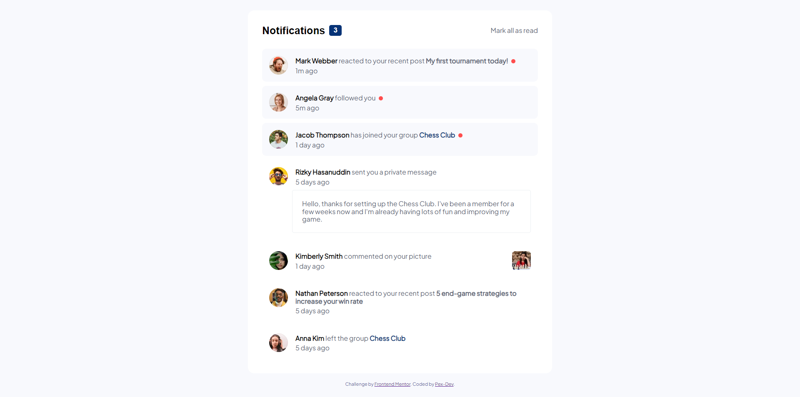
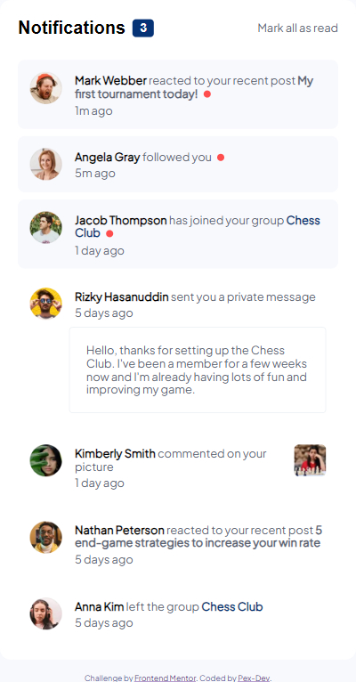

# Frontend Mentor - Notifications page solution

This is a solution to the [Notifications page challenge on Frontend Mentor](https://www.frontendmentor.io/challenges/notifications-page-DqK5QAmKbC). Frontend Mentor challenges help you improve your coding skills by building realistic projects. 

## Table of contents

- [Overview](#overview)
  - [The challenge](#the-challenge)
  - [Screenshot](#screenshot)
  - [Links](#links)
- [My process](#my-process)
  - [Built with](#built-with)
  - [What I learned](#what-i-learned)
  - [Continued development](#continued-development)
- [Author](#author)

**Note: Delete this note and update the table of contents based on what sections you keep.**

## Overview

This is a notifications page where users can mark all notifications as read. I used HTML for the structure, JavaScript for the interactive functionality, and Sass for the styles. Additionally, I used Gulp to compile the Sass code.

### The challenge

Users should be able to:

- Distinguish between "unread" and "read" notifications
- Select "Mark all as read" to toggle the visual state of the unread notifications and set the number of unread messages to zero
- View the optimal layout for the interface depending on their device's screen size
- See hover and focus states for all interactive elements on the page

### Screenshot

|  |  |
|:------------------------------:|:------------------------------:|
| screenshot of the site on a PC     | screenshot of the site on mobile devices     |

### Links

- Solution URL: [Add solution URL here](https://your-solution-url.com)
- Live Site URL: [Add live site URL here](https://your-live-site-url.com)

## My process

### Built with

- Semantic HTML5 markup
- Sass (Syntactically Awesome Stylesheets)
- Flexbox
- JavaScript
- Gulp (Task Runner)

### What I learned

- I learned more about how to structure HTML code in a way that facilitates efficient CSS styling.
- I improved my JavaScript skills by dynamically implementing the functionality to mark notifications as read.
- I gained knowledge on how to design and structure a Markdown file (README.md) to document my project clearly and effectively.

### Continued development

En el futuro, me centraré en aprender más sobre cómo hacer que las páginas web sean más interactivas utilizando JavaScript. También me dedicaré a mejorar mi capacidad para escribir código más organizado y legible. Siento que aún me queda mucho por aprender en estas áreas y estoy comprometido a seguir creciendo profesionalmente en ellas.

## Author

- Frontend Mentor - [@Pex-Dev](https://www.frontendmentor.io/profile/Pex-Dev)